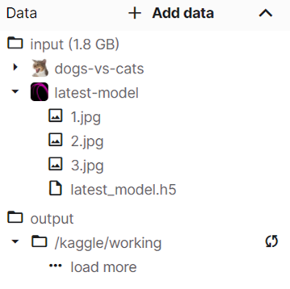
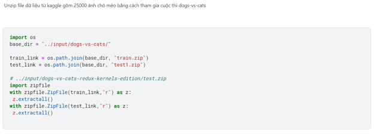
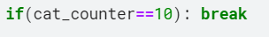
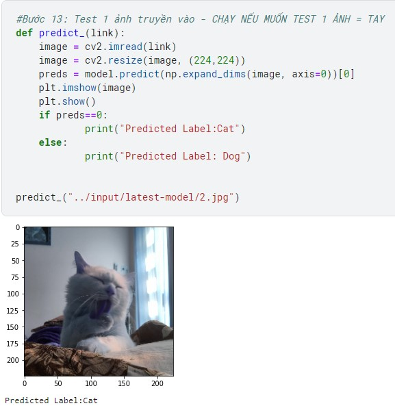

<!-- PROJECT LOGO -->
 

  

<h3 align="center">IMAGE CLASSIFIER FROM SCRATCH</h3>

  

    An image classifier from scratch to distinguish cat photos from dog photos.
     
    <a href="https://github.com/nguyendothanhtruc/image-classifier-from-scratch/tree/main/report"><strong>Explore the docs »</strong></a>
  

<!-- TABLE OF CONTENTS -->

  
Table of Contents

  <ol>
    <li>
      <a href="#about-the-project">About The Project</a>
      <ul>
        <li><a href="#built-with">Built With</a></li>
      </ul>
    </li>
    <li>
      <a href="#getting-started">Getting Started</a>
      <ul>
        <li><a href="#usage">Usage</a></li>
      </ul>
    </li>
    <li><a href="#citation">Citation</a></li>
    <li><a href="#contact">Contact</a></li>
  </ol>

<!-- ABOUT THE PROJECT -->
## About The Project

![Model Architecture][product-screenshot]

[product-screenshot]: images/screenshot.png

Our model was built based on VGG16 model. It contains 6 blocks with layers such as: Convolutional, Pooling, Fully connected layers.

### Convolutional layers
All convolutional layers use `3x3 kernel`, `activate function ReLU`, `padding same` to make the output same size as input. However, the number of kernel used in each blocks is different:

  <table>
    <tr>
      <th>Index</th>
      <th>Number of kernels</th>
    </tr>
    <tr>
      <td>1, 2</td>
      <td>64</td>
    </tr>
    <tr>
      <td>4, 5</td>
      <td>128</td>
    </tr>
    <tr>
      <td>7, 8, 9</td>
      <td>256</td>
    </tr>
    <tr>
      <td>11, 12, 13</td>
      <td>512</td>
    </tr>
    <tr>
      <td>15, 16, 17</td>
      <td>512</td>
    </tr>
  </table>

### Pooling layers
Pooling layers use `max-pooling` with `2x2 filter` and `stride = 2`. Therefore, after pooling layers, the image size is halved. The data matrix will be flatten (at the final pooling layer) to vector which is passed through Fully connected layers.

### Fully connected layers
The final block includes 3 Fully connected layers. The 2 first layers contain `4096 units` and `ReLU activate function` while the other one has 1 unit and `signmoid activate function` to produce 1 output (dog or cat image).

(<a href="#top">back to top</a>)

### Built With

* [Python](https://www.python.org/)
* [NumPy](https://numpy.org/)
* [TensorFlow](https://www.tensorflow.org/)
* [Matplotlib](https://matplotlib.org/)
* [Pandas](https://pandas.pydata.org/)
* [Kaggle](https://www.kaggle.com/)

(<a href="#top">back to top</a>)

<!-- GETTING STARTED -->
## Getting Started

This is an example of how to run our model. To save time and leverage the GPU, we build our model in Kaggle with input and our pre-trained model attached. Our current accuracy for this model is `more than 91%`.

<b>See</b>: [Project in Kaggle](https://www.kaggle.com/nguynngcphnganh/image-classification-42-78-97)
  

### The input structure

The input data is from `Kaggle` includes 25000 pictures from `the competition dogs-vs-cats classification`, which was imported.

  

### Usage
Run the first cell (in Kaggle) to extract files from `input folder` if  `/output/kaggle/working` does not contain `train` and `test1` folders.

  

Run the following steps:
* Step 1: Import libraries
*	Step 2: Determine - Size, channel
* Step 3: Prepare dataset
* Step 4: Define callbacks and learning rate
* Step 5: Split validation and train sets
* Step 6: Generate datasets

We have 2 options: 
* Build new model from scratch 
* Load pre-trained model 

<b>The first option: </b>
* Step 7: Build model from scratch
* Step 8: Compile and validate
* Step 9: Fit model

<b> The second option: </b>
* Step 10: Load pre-trained model

  _If you want to know the current accuracy or train more, after loading run the cell at `Step 9`_

Predict results:
* Step 11: Prepare test sets
* Step 12: Predict in several images

  _The break condition: after predicting 10 cat images_

  

Additional functions:
* Manual test: Test 1 input image (loaded in folder input).

  

* Plot accuracy and loss rate after training N epochs.

(<a href="#top">back to top</a>)

<!-- CITATION -->
## Citation

If you found this project helpful, please consider citing our team.

(<a href="#top">back to top</a>)

<!-- CONTACT -->
## Contact

Nguyễn Đỗ Thanh Trúc - [Facebook](https://www.facebook.com/NDTT0256) - ndttruc2506@gmail.com

Nguyễn Ngọc Phương Anh - [Facebook](https://www.facebook.com/zlou.lulu)

Trần Thái Đức Hiếu - [Facebook](https://www.facebook.com/tranthaiduchieu)

Project Link: [https://github.com/nguyendothanhtruc/image-classifier-from-scratch](https://github.com/nguyendothanhtruc/image-classifier-from-scratch)

(<a href="#top">back to top</a>)

